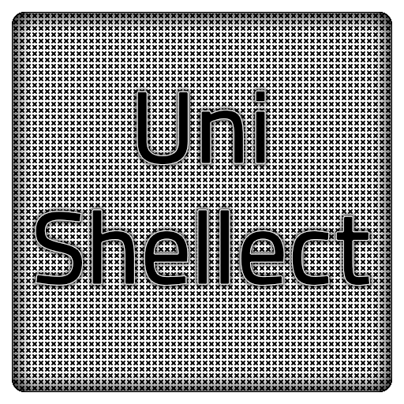

<a name="unishellect"></a>

# UniShellect

|`Build`|`Status`|
|---:|:---|
![Under Construction](https://img.shields.io/static/v1?logo=data:image/png;base64,iVBORw0KGgoAAAANSUhEUgAAAA4AAAAOCAMAAAAolt3jAAAABGdBTUEAALGPC/xhBQAAACBjSFJNAAB6JgAAgIQAAPoAAACA6AAAdTAAAOpgAAA6mAAAF3CculE8AAAB11BMVEUAAAA9U2GDnayLpraOqLeQqbiRqriPqLaPqLaRqriDnaw9U2Fid4SKp7iKp7hid4RfdYGHpbdYbnuCorRSaHV9nrFMYm93ma1HXGlwlKlwlKlBV2NojqQ7UV1hiKA2S1hYgpswRlJQfJcwRlIkMjlDbIVMfJpNfptOfptNfZpRfplTf5lMfJlOfptNfptDbIUkMjkHAAAuR1YzUWMzUWMzUmM0UmQzUWMyUWM0UmQzUmMzUWMzUWMuR1YHAACNsMWRs8aXt8mbuMm3ydSbuMmRs8aIrsONscWStMeZtsfk6u3k6u2ZtseStMeIrsOGrMKKr8SMr8Oswc3u8PHu8PGswc6Mr8OCqcCFrMKJrsOTssTT3OLS3OKTssSJrsOCqcB9pr5/p7+CqcCApryYs8Sdt8aApryCqb9/p799pr52obp4o7x9o7qswc7F09vO2eCwxNCCp7x4ort2obpvnLdxnbd9orjK1t3T3OLK1t7Y4OSFp7twnLZvnbdomLRolrKTsMHb4eWju8mRrsDd4+aiushplrJomLRhkrBik7Bmkq25ydLY3uLW3eHI09ptl69hkrBhkrBZjq1bj65ej613nbSRrr+etsV3nbRika1bjq5Zjq3///97NWaUAAAAP3RSTlMAAlOMioqKioqKUwIMwcEMDsQOxA7EDsQOxMQOxA7EDsQOxA4Lq/Lv7+/v7+/v76sLASI+Pj4+Pj4+Pj4+IgH2SccMAAAAAWJLR0SccbzCJwAAAAd0SU1FB+QIGBYnM5liyzQAAADPSURBVAjXY2BABYxMzCysbOwcnKwszFzcDDy89g6OTs7OLo6u9nz8DAKCbu4enl7ePr7ufoICDELC/gGBQcEhoWEB/sJCDCKi4RGRUdExsXER8aIiDGLiCYlJySmpaekZmeJiDBKSWdk5uXn5BYVFxVISDNIyJaVl5RWVVdU1tTLSDLJydfUNjU3NLa1t7XKyDPIKHZ1d3T29ff0TJirIMygqTZo8Zeq06TNmzpqtpMygoqqmrqGppa2jq6emb8BgaGRsYmpmbmFpZW1jawcAIDgy9UQeYeoAAAAldEVYdGRhdGU6Y3JlYXRlADIwMjAtMDgtMjRUMjI6Mzk6NTEtMDQ6MDBWWeqAAAAAJXRFWHRkYXRlOm1vZGlmeQAyMDIwLTA4LTI0VDIyOjM5OjUxLTA0OjAwJwRSPAAAAABJRU5ErkJggg==&label=AppImage&message=Status&color=b91d47)|

<a class="twitter-share-button"
  href="https://twitter.com/share?ref_src=twsrc%5Etfw&text=%27UniShellect%27%20-%20Create%20command%20line%20menus%20of%20commands%20or%20files%20from%20a%20default%20or%20external%20JSON%20config%20file%2Fs.%0A%23Programming%20%23Coding%20%23Windows%20%23Linux%20via%20%40thefluxapex%0A"></a>

## Table of Contents
- [UniShellect](#unishellect)
  - [Table of Contents](#table-of-contents)
  - [About This Project](#about-this-project)
  - [Motivation](#motivation)
  - [Usage](#usage)
    - [Command Line](#command-line)
      - [Linux Permissions](#linux-permissions)
      - [Help Message](#help-message)
    - [Configuration](#configuration)
      - [Example Configs](#example-configs)
        - [Example Config - Linux](#example-config---linux)
        - [Example Config - Windows](#example-config---windows)
  - [Files](#files)
    - [Linux Files](#linux-files)
    - [Windows Files](#windows-files)
    - [Continuous Build](#continuous-build)
  - [Project Links](#project-links)
  - [Media](#media)
    - [Icon](#icon)
    - [Help Message](#help-message-1)
    - [Demo](#demo)
  - [License](#license)
  - [Project Information](#project-information)
    - [Overall Status](#overall-status)
    - [Latest Version Status](#latest-version-status)

## About This Project

This tool parses a JSON config file and loads a highly customizable menu of shells, interpreters, files, commands and possible arguments into any command line interface.

Various config files can be loaded and this can be great for laoding various menus based on various criteria:
E.g. project menus, work menus, game menus etc...


This is a *cross-platform* `FOSS` project. 

## Motivation

I work and play in all sorts of command line environments in both *Windows* and *Linux* and this helps me organize and navigate that world more effeciently and smoothly.

This is inspired by the `hyper-shellect` plug-in for the `Hyper` terminal which is dependent on `node.js`.

## Usage

### Command Line

This is a command line tool built for use in many different types of shells and terminals in *Windows* and *Linux*. It is meant to be a universal alternative to `hyper-shellect` with additional features (loading different configs, passing arguments, and error handling).

Use any way you can use any other command line tool/executable: from a command line or other executable program or script.

#### Linux Permissions

In `Windows` you can just double click to open in cmd or run in a command line, but in `Linux` you might need to set the programs permissions to executable:


> Make executable for yourself:

```Bash
 $ chmod u+x /path/to/unishellect
```

or: 

> Make executable for for everyone:

```Bash
 $ chmod 755 /path/to/unishellect-x86_64.AppImage
```

or:

```Bash
 $ chmod a+x /path/to/unishellect
```

#### Help Message

```Bash
 $ unishellect --help
                                                  
 USAGE: unishellect [OPTIONS [CONFIG_FILE]...]... 
 Load a menu of shells/files from any CLI...      
                                                  
 OPTIONS:                                         
     -h,--help    This help message.              
     -c,--config  Load an alternate config file.  
     -s,--supress Supress errors.                 
                                                  
 CONFIG_FILE: unishellect -c "/path/to/file.json" 
 Load an alternate config file.                   
 The default config file: "unishellect.json"      
 should be created in the user's HOME             
 directory.                                       
                                                  
 ERRORS:                                          
     0            No errors.                      
     1            Passed config file does not     
                  exist.                          
     2            Could not create config         
                  Directory.                      
     3            Could not create default        
                  config file.                    
     4            Not items found in the config   
                  file.                           
     5            A key was not found in config.  
     6            Error running command.          
                                           
```

### Configuration

The default `JSON` configuration file: `unishellect.json` will be created in the corresponding `%AppData%\UniShellect\` or `.config/UniShellect/` directory in `Windows` and `Linux` respectively on first run if no `-c` option has been passed with an alternate configuration file.

By default the configuration file is empty and you must add your own options.

|Operating System|Default Config Path|
|:---:|:---:|
|Windows|`%AppData%\UniShellect\unishellect.json`|
|Linux|`$HOME/.config/UniShellect/unishellect.json`|

#### Example Configs

##### Example Config - Linux

```JSON
 {
     "Shells": {
        "1": {
            "Title":"Python 3",
            "Path":"python3",
            "Args":"-q",
        },
        "2": {
            "Title":"GNU Screen - Temp",
            "Path":"screen",
            "Args":"-S Temp",
        },
        "3": {
            "Title":"Edit this menu",
            "Path":"vim",
            "Args":"${HOME}/.config/UniShellect/unishellect.json",
        }
    }
 }
```

##### Example Config - Windows

```JSON
 {
     "Shells": {
        "1": {
            "Title":"Python 3",
            "Path":"python3",
            "Args":"-q",
        },
        "2": {
            "Title":"PowerCore",
            "Path":"C:\\Program Files\\PowerCore\\7.0\\pwsh.exe",
            "Args":"-NoLogo",
        },
        "3": {
            "Title":"Edit this menu",
            "Path":"vim",
            "Args":"%AppData%\\UniShellect\\unishellect.json",
        }
    }
 }
```

## Files

|File|Description|
|:---:|:---:|
|[Source Files - All](archives/source_unishellect_all.7z)|Complete project - no compilations.|

### Linux Files

|File|Description|
|:---:|:---:|
|[Source Files](archives/source_unishellect_linux.7z)|Linux source - no compilations.|
|[Compiled](dist/linux/bin/unishellect)|Compiled binary executable with no dependencies.|
|[AppImage](dist/linux/appimage/unishellect-x86_64.AppImage)|Single executable with all dependencies.|

### Windows Files

|File|Description|
|:---:|:---:|
|[Source Files](archives/source_unishellect_windows.7z)|Windows source - no compilations.|
|[Compiled](dist/windows/bin/unishellect.exe)|Compiled binary executable with no dependencies.|

### Continuous Build

The current released compiled binary executables. These should correlate to the above compilations, but just in case these are the "official" current releases.

|File|Description|
|:---:|:---:|
|[Linux - EXE](https://github.com/Lateralus138/UniShellect/releases/download/Continuous/unishellect)|Linux source - no compilations.|
|[Linux - AppImage](https://github.com/Lateralus138/UniShellect/releases/download/Continuous/unishellect-x86_64.AppImage)|Packaged `AppImage` with all dependencies.|
|[Windows - EXE](https://github.com/Lateralus138/UniShellect/releases/download/Continuous/unishellect.exe)|Single executable with all dependencies.|

## Project Links

|Link|Description|
|:--:|:--:|
|[Official Project Page](https://lateralus138.github.io/UniShellect)|The themed version of this page.|
|[Project Page](https://github.com/Lateralus138/UniShellect/)|This repository page.|
|[Current Releases](https://github.com/Lateralus138/UniShellect/releases/tag/Continuous)|The release files in "Continuous Build".|

## Media

### Icon



### Help Message


### Demo


## [License](./LICENSE)

>This program is free software: you can redistribute it and/or modify it under the terms of the GNU General Public License as published by the Free Software Foundation, either version 3 of the License, or (at your option) any later version.

>This program is distributed in the hope that it will be useful, but WITHOUT ANY WARRANTY; without even the implied warranty of MERCHANTABILITY or FITNESS FOR A PARTICULAR PURPOSE.  See the GNU General Public License for more details.

## Project Information


### Overall Status


|Description|Status|
|:---:|:---:|
|Project Release Date||
|Total downloads for this project||
|Complete repository size||
|Commits in last month||
|Commits in last year||

### Latest Version Status

|Description|Status|Number of Downloads|
|:---:|:---:|:---:|
|Latest Release version|||
|Latest Tag version, possible Pre-Release's|||
